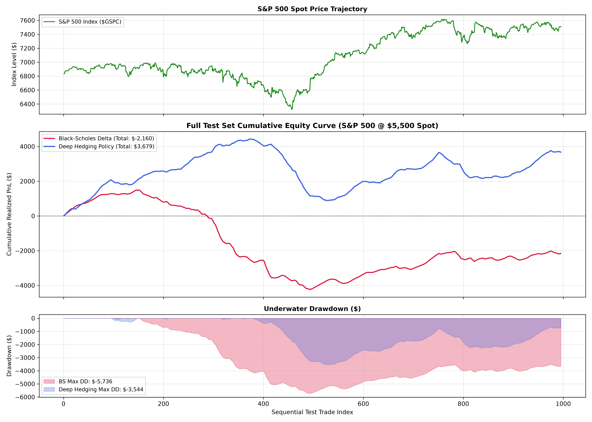
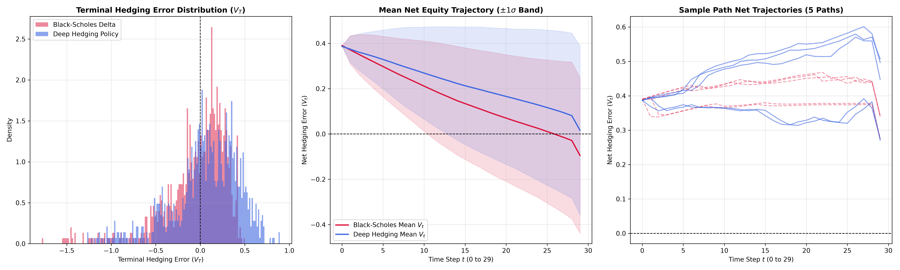
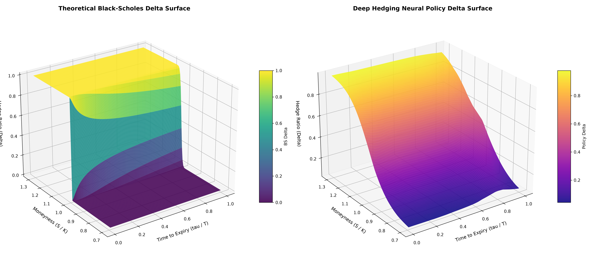
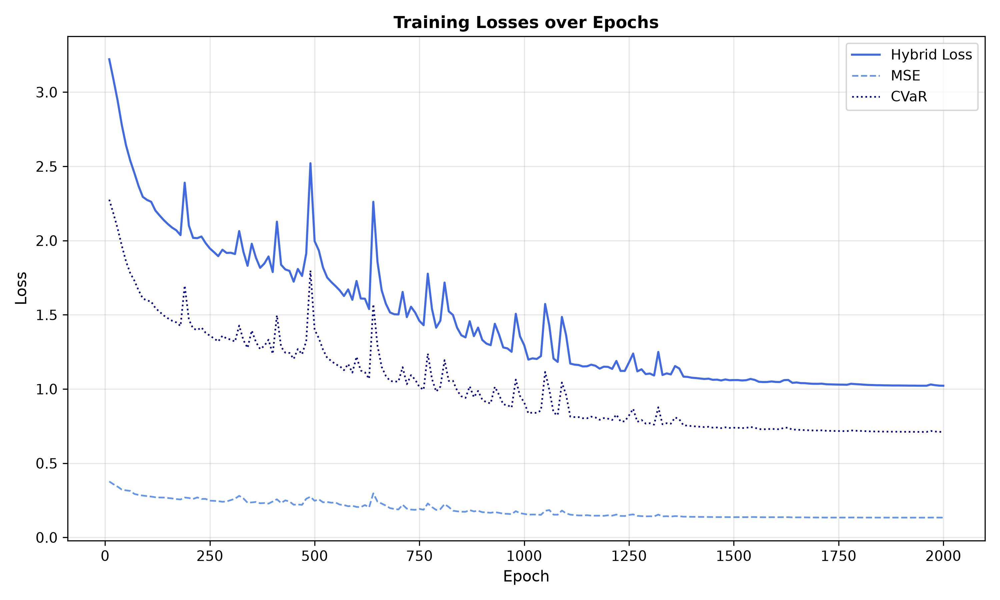

# cuda deep hedging

A deep reinforcement learning approach to option pricing and hedging using CUDA.

```bash
mkdir build
cd build && cmake .. 
make -j
./deep_hedger 
cd .. && python scripts/analysis.py
```

## Performance Comparison (S&P 500)

| Strategy | Black-Scholes Delta | Deep Hedging Policy |
| :--- | :--- | :--- |
| **Mean PnL** | -0.0395 | 0.0672 |
| **Median PnL** | 0.0474 | 0.1060 |
| **Std Dev** | 0.3519 | 0.3728 |
| **Sharpe Ratio** | -0.1121 | 0.1803 |
| **Sortino Ratio** | -0.0840 | 0.1548 |
| **Win Rate (%)** | 55.7789 | 63.4171 |
| **95% VaR** | -0.6468 | -0.6655 |
| **95% CVaR (Expected Shortfall)** | -1.0978 | -0.9237 |
| **99% VaR** | -1.4135 | -1.0534 |
| **99% CVaR** | -1.5133 | -1.1716 |
| **Mean MSE** | 0.1254 | 0.1435 |
| **Max Trajectory DD** | -0.4854 | -0.3705 |

## Visualizations

### Full Equity Curve Comparison


### PnL Trajectory Analysis


### Hedging Surface 3D


### Training Losses
